# Goliath Dispatch — Data Model

> Reference for all 92 tables in `src/db/schema/`. This document assumes you
> have read `docs/architecture.md` §3 (multi-tenancy) and §6 (financial
> engine) — it does not repeat the reasoning there, only the mechanics.
> Column names below are the TypeScript property names from the schema
> files; the underlying SQL column is the `snake_case` equivalent Drizzle
> generates from the string literal passed to each column builder.

Every table lives in exactly one file under `src/db/schema/`:
`_shared.ts` (column helpers and enums, no tables), `tenant.ts`, `auth.ts`,
`carrier.ts`, `customer.ts`, `document.ts`, `driver.ts`, `equipment.ts`,
`finance.ts`, `load.ts`, `messaging.ts`, `platform.ts`, `route.ts`,
`signature.ts`, `tracking.ts`.

## Contents

1. [High-level domain map](#1-high-level-domain-map)
2. [The tenancy pattern](#2-the-tenancy-pattern)
3. [Immutability](#3-immutability)
4. [Money](#4-money)
5. [Soft deletion and retention](#5-soft-deletion-and-retention)
6. [Index rationale](#6-index-rationale)
7. Domain groups (tables, columns, indexes, invariants):
   - [7.1 Tenancy & identity](#71-tenancy--identity)
   - [7.2 Carriers & onboarding](#72-carriers--onboarding)
   - [7.3 Documents & signatures](#73-documents--signatures)
   - [7.4 Equipment & drivers](#74-equipment--drivers)
   - [7.5 Customers](#75-customers)
   - [7.6 Loads & stops](#76-loads--stops)
   - [7.7 Routes, oversize & permits](#77-routes-oversize--permits)
   - [7.8 Financials](#78-financials)
   - [7.9 Messaging & notifications](#79-messaging--notifications)
   - [7.10 Tracking](#710-tracking)
   - [7.11 Platform, audit & retention](#711-platform-audit--retention)

Per-group diagrams are also checked in standalone at
`docs/diagrams/00-overview.mermaid` through `docs/diagrams/11-platform-audit-retention.mermaid`
if you want to paste one into a renderer without the surrounding prose.

---

## 1. High-level domain map

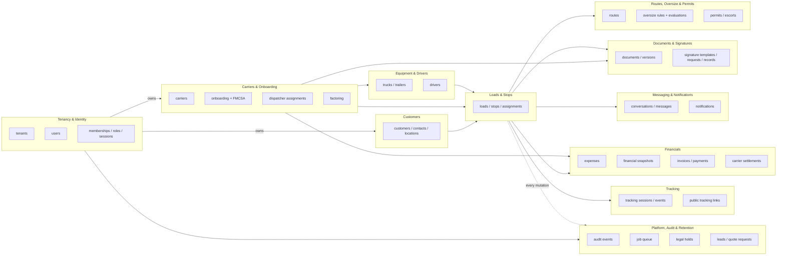

---

## 2. The tenancy pattern

Every tenant-owned table carries a non-null `tenantId` column — this is
`tenantScoped` in the sense architecture.md §3 describes, though the actual
Drizzle helper is written out per-column rather than spread from a shared
object (see the comment at the top of `_shared.ts`: computed column names
would break Drizzle's literal-key type inference, so the verbosity is
intentional).

**Composite `(tenant_id, id)` keys.** `drizzle/custom/0002_tenant_guards.sql`
adds a `unique (tenant_id, id)` constraint to the parent tables a foreign key
might need to jump through tenant-safely:

`carriers`, `customers`, `loads`, `drivers`, `trucks`, `trailers`,
`documents`, `invoices`, `dispatcher_groups`, `equipment_types`.

**Trigger-enforced cross-tenant guards.** The same migration installs a
`before insert or update` trigger (`goliath_assert_tenant_matches`) on every
child table listed below, comparing the child's `tenant_id` against the
parent row's `tenant_id`. A mismatch raises a Postgres exception
(`integrity_constraint_violation`) — this fires even if application code
built the row from a stale or forged id, and even under `unsafeDb`.

| Child table | Column | Parent table |
|---|---|---|
| `trucks` | `carrier_id` | `carriers` |
| `trailers` | `carrier_id` | `carriers` |
| `carrier_users` | `carrier_id` | `carriers` |
| `driver_carrier_relationships` | `carrier_id` | `carriers` |
| `driver_carrier_relationships` | `driver_id` | `drivers` |
| `loads` | `carrier_id` | `carriers` |
| `loads` | `customer_id` | `customers` |
| `load_stops` | `load_id` | `loads` |
| `load_assignments` | `load_id` | `loads` |
| `load_assignments` | `truck_id` | `trucks` |
| `load_assignments` | `trailer_id` | `trailers` |
| `load_assignments` | `driver_id` | `drivers` |
| `load_documents` | `load_id` | `loads` |
| `load_documents` | `document_id` | `documents` |
| `customer_contacts` | `customer_id` | `customers` |
| `customer_locations` | `customer_id` | `customers` |
| `invoices` | `carrier_id` | `carriers` |
| `invoices` | `load_id` | `loads` |
| `invoice_line_items` | `invoice_id` | `invoices` |
| `payments` | `invoice_id` | `invoices` |
| `expenses` | `load_id` | `loads` |
| `financial_snapshots` | `load_id` | `loads` |
| `permits` | `load_id` | `loads` |
| `escorts` | `load_id` | `loads` |
| `routes` | `load_id` | `loads` |
| `tracking_sessions` | `load_id` | `loads` |
| `public_tracking_links` | `load_id` | `loads` |
| `document_versions` | `document_id` | `documents` |

A relationship absent from this list (e.g. `messages.conversation_id`,
`signature_requests.template_id`) is not guarded at the database level; it
relies on the application layer (`tenantDb`) and the fact that both sides of
every such relationship are looked up through the same tenant-scoped handle
in the same request. The list above is deliberately the highest-risk subset
— the tables an attacker-controlled or buggy id would most plausibly reach
across a tenant boundary (financial, assignment and document relationships).

Non-negative and range checks the same migration adds:

- `>= 0` on `loads.customer_charge_cents`, `loads.carrier_gross_rate_cents`,
  `expenses.amount_cents`, `invoices.total_cents`,
  `invoices.amount_paid_cents`, `payments.amount_cents`,
  `permits.cost_cents`, `escorts.cost_cents`.
- `between 0 and 10000` (0–100%) on `loads.carrier_dispatch_fee_bps`,
  `loads.dispatcher_commission_bps`, `carriers.dispatch_fee_bps`,
  `dispatcher_profiles.commission_bps`.

**Application layer.** `src/db/tenant-db.ts`'s `tenantDb(tenantId)` injects
`tenant_id = $tenant` and the soft-delete predicate into every query it
builds; ESLint (`eslint.config.mjs`) blocks importing `unsafeDb` outside an
explicit allow-list (migrations, seeds, jobs, auth/session code, platform
Super Admin tooling, and tests). `resourceInScope()` in
`src/lib/permissions/check.ts` re-checks the tenant boundary before
evaluating a permission scope.

**Storage.** Object keys are always `tenants/{tenantId}/…`
(`src/lib/storage/keys.ts`); `assertKeyBelongsToTenant` refuses to sign a URL
for a key outside the caller's own prefix.

**A carrier is not a global entity.** A carrier that works with two dispatch
companies is two independent `carriers` rows, one per tenant, each with its
own onboarding, documents, equipment and FMCSA verification history — see
`docs/assumptions.md` for why.

---

## 3. Immutability

`drizzle/custom/0001_audit_immutability.sql` enforces, at the database
level, guarantees no application bug or compromised role can undo:

**Strictly append-only (`UPDATE`/`DELETE` rejected outright)** via
`goliath_reject_mutation()`:

- `audit_events`
- `signature_audit_events`
- `load_status_history`

**Narrowly mutable, everything else frozen:**

| Table | Trigger | What may change | What is frozen |
|---|---|---|---|
| `stripe_events` | `goliath_stripe_event_guard` | `processing_status`, `processed_at`, `tenant_id`, `attempts`, `error_message` (anything not listed as frozen) | `stripe_event_id`, `event_type`, `payload_digest` — deletes rejected entirely |
| `financial_snapshots` | `goliath_financial_snapshot_guard` | Retention columns (`archived_at`, `purge_eligible_at`, `legal_hold`) | `load_id`, `version`, `customer_charge_cents`, `carrier_gross_rate_cents`, `commissionable_base_cents`, `dispatch_fee_amount_cents`, `net_carrier_settlement_cents`, `gross_margin_cents`, `dispatcher_commission_amount_cents` — deletes rejected entirely |
| `signature_records` | `goliath_signature_record_guard` | Retention columns | `integrity_seal`, `document_sha256`, `signature_sha256`, `signer_legal_name`, `signed_at` — deletes rejected entirely |

A changed fee percentage, a corrected category treatment, or a settings edit
never rewrites history: `financial_snapshots` accumulates a new `version`
row per load instead (`financial_snapshots_load_version_uq` on
`(load_id, version)`), and the application always reads the highest version
as current.

**`updated_at` maintenance.** Every table carrying an `updated_at` column
(i.e. every table using the `timestamps` or `auditable` spread), except the
three strictly append-only tables above, gets a `before update` trigger
(`goliath_touch_updated_at`) that stamps `now()` — the application never
needs to set this column itself.

---

## 4. Money

Every monetary column is `bigint` in `mode: 'number'` (the `cents()` helper
in `_shared.ts`) — an integer count of US cents, never a float, never a
`numeric` string interpreted as currency in application code. Every
percentage is an integer count of basis points (1 bp = 0.01%), enforced to
the `[0, 10000]` range by the `0002_tenant_guards.sql` check constraints
listed in §2.

The formulas, reproduced verbatim from `src/lib/money/index.ts`:

```
commissionableBase   = max(0, carrierGrossRate − approvedExcludedExpenses)
dispatchFeeAmount    = commissionableBase × carrierDispatchFeeBps / 10000   (half-up)
netCarrierSettlement = carrierGrossRate + approvedReimbursableExpenses
                        − dispatchFeeAmount − carrierDeductions
grossMargin          = customerCharge − carrierGrossRate − tenantAbsorbedExpenses
dispatcherCommissionBasisAmount =
    dispatcherCommissionBasis == 'carrier_gross_rate'    ? carrierGrossRate
  : dispatcherCommissionBasis == 'commissionable_base'   ? commissionableBase
  : /* 'dispatch_fee_amount', the default */                dispatchFeeAmount
dispatcherCommissionAmount = dispatcherCommissionBasisAmount × dispatcherCommissionBps / 10000  (half-up)
```

Term definitions:

| Term | Meaning |
|---|---|
| `customerCharge` | What the tenant bills the customer for the load (`loads.customerChargeCents`). |
| `carrierGrossRate` | What the tenant owes the carrier before fees (`loads.carrierGrossRateCents`). |
| `approvedExcludedExpenses` | Sum of **approved** expenses whose category treatment is `excluded_from_commission` — permits and escorts ship as system categories with this treatment by default, so the dispatch fee is never earned on money that only passed through. |
| `approvedReimbursableExpenses` | Sum of approved expenses treated `reimbursable_to_carrier` — added back to what the carrier is paid. |
| `tenantAbsorbedExpenses` | Sum of approved expenses treated `tenant_absorbed` — reduces the tenant's own margin, not the carrier's settlement. |
| `carrierDeductions` | Sum of approved expenses treated `carrier_deduction` — subtracted from the carrier's settlement. |
| `carrierDispatchFeeBps` | The percentage the dispatch company charges this carrier on this load (snapshotted from `carriers.dispatchFeeBps` onto the load, then onto the snapshot). |
| `dispatcherCommissionBps` / `dispatcherCommissionBasis` | The dispatcher's own commission rate and which of the three bases it applies to — a cost to the dispatch company, entirely separate from, and never reducing, the carrier's settlement. |

Only expenses with `status IN ('approved', 'reimbursed')` are included
(`groupApprovedExpenses()`); a `submitted` or `rejected` expense is
advisory only and never touches the math. `applyBps()` rounds half-up on
the magnitude (`roundHalfUp`), matching how a dispatcher would compute a fee
by hand.

**The snapshot pattern.** `financial_snapshots` stores every input and every
output of one calculation, versioned per load
(`financial_snapshots_load_version_uq` on `(loadId, version)`), with
`formulaVersion` (currently `'v1'`) pinned alongside so a future formula
change is distinguishable from a data change in the historical record. The
table is append-only per §3 above — a corrected fee percentage or category
treatment writes a new, higher-versioned row; it never rewrites row N.
`dispatcherCommissions`, `invoiceLineItems` (kind `dispatch_fee`), and
`carrierSettlementLines` all reference a specific `financialSnapshotId`
rather than recomputing, so a settlement or invoice always reflects the
snapshot it was built from even if the load's live numbers later change.

---

## 5. Soft deletion and retention

Every tenant-owned table that participates in the retention pipeline
spreads two shapes from `_shared.ts`:

- **`softDelete`**: `deletedAt`, `deletedBy`, `deletionReason`. Set by
  application code; `tenantDb`'s default queries filter `deletedAt IS NULL`
  automatically. This is the routine "the user clicked delete" path.
- **`retention`**: `archivedAt`, `purgeEligibleAt`, `legalHold`. Driven by
  the retention job handlers (`src/jobs/handlers/retention-archive.ts`,
  `retention-purge.ts`), not by user action. `legalHold` is a denormalized
  boolean kept in sync with `legal_holds` rows so a query can check it
  without a join; the authoritative record of *why* is always the
  `legal_holds` table.

`src/server/retention/policy.ts` is the single source of which tables are
`operational` (24 months active → archive → purge 5 years after archival)
versus `financial` (never purged before 7 years, regardless of archival
state) — both the retention job handler and the retention settings UI read
`classifyEntity()` from this one module so the two can never disagree about
a table's class. See `docs/operations.md` for the day-to-day mechanics
(applying/releasing a hold, running the sweeps) and `docs/deployment.md`'s
backup section for how retention interacts with object storage.

**How a purge-eligible row is actually disposed of** is itself a per-entity
choice — `EntityRetentionInfo.purgeStrategy`, defaulting to `'delete'` (a
real `DELETE`, via `TenantDb.purge()`, which refuses to run without an
explicit `{ legalHoldChecked: true }` proof) when omitted. Two tables are
deliberate exceptions to a plain delete:

- **`loads` — `purgeStrategy: 'anonymize'`.** `load_status_history` and
  `financial_snapshots` are append-only children of a load
  (`drizzle/custom/0001_audit_immutability.sql` rejects every `UPDATE`/
  `DELETE` against them unconditionally, by design), and both
  cascade-reference `loads.id` — so a real `DELETE FROM loads` can never
  succeed for any load that has gone through even one status transition.
  Rather than weaken that trigger with a "retention-authorized" delete
  bypass, a purge-eligible load is instead soft-deleted (`deletedAt` set,
  dropping it out of every ordinary tenant-scoped query) and its free-text
  columns are redacted (`customerReference`, `poNumber`,
  `specialInstructions`, `internalNotes`, `cancellationReason`) while its
  id, dates, financial columns and FKs are left intact. The load's own
  `financial_snapshots` are unaffected either way — they are independently
  classified `financial` and retained under the 7-year floor regardless.
  Implemented in `src/jobs/handlers/retention-purge.ts`'s
  `anonymizeArchivedLoads()`.
- **`signature_records` (and `signature_audit_events`) — no purge path at
  all**, by design. They are executed legal instruments whose evidentiary
  value must never expire; `signature_records_guard` forbids their deletion
  unconditionally with no anonymize fallback, and the purge job does not
  attempt one — shipping a purge attempt guaranteed to fail every week
  would be worse than not attempting it.

**Purge sweep coverage is a deliberate subset of the full retention
registry.** `retention-purge.ts` currently only processes `documents`
(delete), `invoices` (delete), and `loads` (anonymize) — purging the
remaining registered entity types generically would mean deleting rows
other, non-retention tables may still reference by foreign key, which needs
a per-entity cascade/ordering decision not yet implemented for the rest of
the registry. See `docs/implementation-checklist.md` for this tracked as a
scope gap, not a bug.

**Production safety valve.** A purge is irreversible, so in
`APP_ENV=production` the handler refuses to do anything unless its job
payload carries `confirm: true`. The scheduled weekly cron
(`/api/cron/retention-purge`) never sets that flag — so in production this
schedule fires every week, finds candidates, and logs a refusal, performing
no deletion until an operator deliberately re-enqueues the job with
`{ confirm: true }`. See `docs/operations.md` §1 for how to do that.

Three tables carry `legal_hold`/retention columns but are marked
`supportsArchival: false` in the registry because their lifecycle is
structurally tied to something else: `financial_snapshots` and
`signature_audit_events` are append-only (§3) and archive with their parent
load/request rather than independently; `consent_records` and
`audit_events` are financial-class but have no archival column at all —
they are retained in place for the full 7 years and purged, never archived.

---

## 6. Index rationale

A recurring shape across nearly every table: `index('<table>_tenant_idx').on(t.tenantId)`.
Every list screen in the application starts with a tenant predicate, so this
index (or a composite one leading with `tenantId`) backs essentially every
query in the product. Beyond that baseline:

- **Status indexes** (`carriers_tenant_status_idx`, `loads_tenant_status_idx`,
  `trucks_status_idx`, `documents_review_status_idx`,
  `invoices_tenant_status_idx`, `notifications_user_unread_idx`, …) — every
  board/kanban/list view in the application (onboarding queue, load board,
  document review queue, invoice list) filters by status first.
- **Assignment indexes** (`memberships_tenant_role_idx`,
  `carrier_dispatcher_active_idx` on `(tenantId, dispatcherUserId, endDate)`,
  `dispatcher_resource_tenant_idx`, `load_assignments_truck_idx` /
  `_trailer_idx` / `_driver_idx` on `(tenantId, resourceId, committedFrom)`)
  — these back both "what is this dispatcher responsible for" scope
  resolution (`resourceInScope()`) and the conflict-detection query that
  looks for an overlapping commitment before a resource is assigned to a
  second load.
- **Expiration indexes** (`carriers_next_verification_idx`,
  `documents_expires_soon_idx`, `trucks_registration_exp_idx`,
  `drivers_license_expiry_idx`, `drivers_medical_expiry_idx`,
  `permits_expiry_idx`, `public_tracking_links_expiry_idx`,
  `idempotency_keys_expiry_idx`) — every cron sweep in `docs/operations.md`
  is a `WHERE <expiry column> <= now()` scan; each has its own index rather
  than sharing one composite, because each sweep runs independently on its
  own schedule against a different table.
- **Load-date indexes** (`loads_tenant_pickup_idx`, `loads_tenant_delivery_idx`,
  `load_stops_window_idx`) — the calendar and timeline load-board views
  (`src/app/[locale]/(app)/app/loads/_components/loads-calendar-view.tsx`,
  `loads-timeline-view.tsx`) both range-query by date within a tenant.
- **DOT/MC indexes** (`carriers_tenant_dot_uq` — unique, one DOT per tenant —
  plus `carriers_tenant_mc_idx`, `customers_tenant_dot_idx`,
  `customers_tenant_mc_idx`) — onboarding duplicate-detection and the
  carrier/customer search typeahead both look up by these columns.
- **VIN indexes** (`trucks_tenant_vin_uq`, `trailers_tenant_vin_uq`, both
  unique on `(tenantId, vinNormalized)`) — VIN uniqueness per tenant is a
  hard constraint, and equipment/COI-verification lookups
  (`equipment_verifications`) join through the normalized VIN so OCR output
  from a COI can be matched without depending on the carrier's own
  formatting.

---

## 7. Domain groups

### 7.1 Tenancy & identity

`tenant.ts`, `auth.ts` — 6 + 12 = 18 tables.

```mermaid
erDiagram
    tenants ||--o| tenant_branding : has
    tenants ||--o| tenant_settings : has
    tenants ||--o{ tenant_subscriptions : has
    tenants ||--o{ equipment_types : defines
    saas_plans ||--o{ tenant_subscriptions : "priced by"
    tenants ||--o{ user_tenant_memberships : has
    users ||--o{ user_tenant_memberships : holds
    users ||--o{ sessions : has
    users ||--o{ mfa_configurations : has
    users ||--o{ verification_tokens : has
    users ||--o{ consent_records : gives
    users ||--o{ impersonation_sessions : "acts as (actor/target)"
    permissions ||--o{ role_permissions : "granted via"
    users ||--o{ user_permission_overrides : "may have"
    tenants ||--o{ user_permission_overrides : scopes

    tenants {
        uuid id PK
        varchar slug UK
        varchar custom_domain UK
        enum status
        varchar default_locale
    }
    users {
        uuid id PK
        varchar email_normalized UK
        enum status
        boolean is_platform_super_admin
    }
    user_tenant_memberships {
        uuid id PK
        uuid tenant_id FK
        uuid user_id FK
        enum role
        uuid carrier_id "set for carrier/driver roles"
        uuid driver_id
    }
    permissions {
        uuid id PK
        varchar key UK "resource:action"
    }
    role_permissions {
        enum role
        uuid permission_id FK
        varchar scope
    }
    user_permission_overrides {
        uuid tenant_id FK
        uuid user_id FK
        uuid permission_id FK
        varchar effect "grant|deny"
    }
    sessions {
        uuid id PK
        uuid user_id FK
        varchar token_hash UK "sha256, opaque"
        uuid active_tenant_id FK
        timestamp expires_at
        timestamp revoked_at
    }
    impersonation_sessions {
        uuid id PK
        uuid actor_user_id FK
        uuid target_user_id FK
        uuid tenant_id FK
        timestamp expires_at "60 min ceiling"
    }
```

| Table | Purpose | Key columns | Invariants |
|---|---|---|---|
| `tenants` | One dispatch company. | `slug` (UK), `customDomain` (UK, nullable), `status` (provisioning→trialing→active→past_due→suspended→cancelled), `defaultLocale`/`defaultTimezone` | `tenants_status_idx` backs the platform tenant list filtered by status. |
| `tenant_branding` | Per-tenant logo/colors/fonts for the app shell, emails and generated PDFs. | Hex color columns default to the platform palette; `headingFont`/`bodyFont` default to the two self-hosted npm fonts. | 1:1 with `tenants` (`tenant_branding_tenant_uq`). |
| `tenant_settings` | Every tenant-configurable policy: document expiration warning window, FMCSA reverification cadence, `allowDispatcherResourceAssignment`, load/invoice numbering sequences, financial defaults, retention windows, public tracking TTL, signature consent copy. | `loadNumberNextSequence`/`invoiceNumberNextSequence` — see `docs/assumptions.md` for the concurrency approach to numbering. | 1:1 with `tenants`. |
| `saas_plans` | Platform-defined subscription tiers (Starter/Growth/Enterprise), bilingual name/description, Stripe price/product ids, seat/carrier/load limits. | `code` (UK) | — |
| `tenant_subscriptions` | One tenant's current plan and Stripe subscription state. | `stripeSubscriptionId` (UK), `status`, `currentPeriodEnd`, `trialEndsAt` | Synced from Stripe webhooks (`customer.subscription.*`). |
| `equipment_types` | Tenant-editable trailer/truck taxonomy (`category`: trailer\|truck), with `isSystem` seeded types and `supportsRgn` for removable-gooseneck trailers. | `code` (UK per tenant) | — |
| `users` | One global identity per email; a user gains capability only through memberships (see the docstring in `auth.ts` — this is deliberate, not an oversight). | `emailNormalized` (UK), `isPlatformSuperAdmin`, `status`, `failedLoginAttempts`/`lockedUntil` | No `tenantId` column by design. |
| `user_tenant_memberships` | The join between a user and a tenant, carrying the role. | `role` enum, `carrierId`/`driverId` set only for `carrier`/`driver` roles, `isPrimaryContact` | UK on `(tenantId, userId, role)` — one row per role per tenant, so a user can hold two roles in the same tenant as two rows. |
| `permissions` | The permission catalog as data (`resource:action` keys), bilingual descriptions. | `key` (UK) | Generated into `docs/permissions.md`; do not hand-edit either. |
| `role_permissions` | Which scope each role holds for each permission. | UK on `(role, permissionId)` | This table plus `catalog.ts`'s in-code matrix must agree — see CONTRIBUTING.md's "add a permission" workflow. |
| `user_permission_overrides` | Per-user grant/deny exceptions to the role matrix, with a mandatory reason and optional expiry. | `effect` (grant\|deny), `reason` (not-null) | UK on `(tenantId, userId, permissionId)` — one override per permission per user. |
| `sessions` | Opaque, database-backed session (see architecture.md's rationale for not using JWTs). | `tokenHash` (UK, SHA-256 of the cookie value), `activeTenantId`, `mfaSatisfiedAt`, `expiresAt`, `revokedAt` | Raw token never touches the database — only its hash. |
| `mfa_configurations` | TOTP secret (encrypted) and hashed recovery codes per user. | `secretEncrypted`, `recoveryCodeHashes` (hashed array) | UK on `(userId, method)`. |
| `verification_tokens` | Single-use tokens for email verification, password reset, invitation acceptance. | `tokenHash` (UK), `purpose`, `expiresAt`, `consumedAt` | `verification_tokens_expires_idx` backs the cleanup sweep. |
| `consent_records` | Every privacy policy / terms / e-signature / SMS / tracking consent capture, including pre-account (public form) consent via `subjectEmail`. | `consentType`, `policyVersion`, `granted`, `revokedAt` | Financial-class retention (§5) — never purged before 7 years. |
| `impersonation_sessions` | One row per support-access session. | `actorUserId` (initiator) vs `targetUserId` (whose authority is assumed), `expiresAt` = `startedAt` + 60 minutes, no renewal | See `docs/assumptions.md` for why 60 minutes and no renewal. |
| `login_attempts` | Append-in-practice ledger (no update/delete path in code) of every login attempt, success or failure, for brute-force detection and audit. | Indexed by `(emailNormalized, createdAt)` and `(ipAddress, createdAt)` | — |
| `rate_limit_buckets` | Durable rate-limit counters, used when `RATE_LIMIT_DRIVER=database`. | UK on `(bucketKey, windowStart)` | In-memory alternative exists for single-instance dev; see `docs/deployment.md`. |

---

### 7.2 Carriers & onboarding

`carrier.ts` — 12 tables.

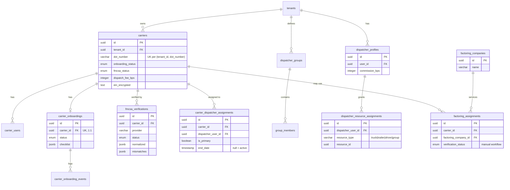

| Table | Purpose | Key columns | Invariants |
|---|---|---|---|
| `carriers` | One carrier company as known to one tenant. | `dotNumber` (UK per tenant), `einEncrypted`/`einLast4`, `dispatchFeeBps`, `onboardingStatus`, `fmcsaStatus`/`fmcsaNextVerificationAt` | `carriers_next_verification_idx` (unscoped by tenant, global) backs the daily FMCSA reverification sweep across all tenants at once. |
| `carrier_users` | Which platform users belong to a carrier's own portal access. | UK on `(tenantId, carrierId, userId)` | — |
| `carrier_onboardings` | The one active onboarding workflow per carrier. | `status` (draft→submitted→under_review→corrections_required→approved/rejected/suspended), `checklist` (jsonb array of `{key, complete, blocking}`) | UK on `carrierId` — exactly one row per carrier. |
| `carrier_onboarding_events` | Status-transition log for one onboarding. | `fromStatus`/`toStatus`, `actorUserId`, `reason` | Not database-enforced append-only, but no update/delete code path exists. |
| `dispatcher_profiles` | A dispatcher's own commission rate and employment metadata. | `commissionBps` | UK on `(tenantId, userId)`. |
| `carrier_dispatcher_assignments` | Which dispatcher(s) are responsible for a carrier, with history. | `isPrimary`, `startDate`/`endDate` (null `endDate` = currently active) | `carrier_dispatcher_active_idx` on `(tenantId, dispatcherUserId, endDate)` is what `resourceInScope()` queries to resolve a Dispatcher's `assigned` scope. |
| `dispatcher_groups` | Named groups of carriers/trucks/trailers/drivers a dispatcher (or Admin) manages together. | `ownerDispatcherUserId` | UK on `(tenantId, name)`. |
| `group_members` | Polymorphic membership row (carrier\|truck\|trailer\|driver) in a group. | `memberType`, `memberId` | UK on `(groupId, memberType, memberId)`. |
| `dispatcher_resource_assignments` | Explicit resource-level grants beyond carrier assignment — a Dispatcher assigned to a carrier may still only touch the trucks/trailers/drivers/groups granted here. | `resourceType`, `resourceId`, `startDate`/`endDate` | Only consulted when `allowDispatcherResourceAssignment` is on. |
| `fmcsa_verifications` | One row per FMCSA lookup attempt for a carrier — the ledger, not just the latest result. | `normalized` (provider-independent snapshot), `mismatches` (field-by-field diff), `overriddenByUserId`/`overrideReason` | `fmcsa_verifications_carrier_idx` on `(carrierId, checkedAt)` — the carrier detail page always reads the latest by this index. |
| `factoring_companies` | Tenant's roster of factoring companies. | UK on `(tenantId, name)` | — |
| `factoring_assignments` | A carrier's factoring relationship — **entirely a manual, human-confirmed workflow**; there is no funding API (see `docs/integrations.md`). | `verificationStatus`, `noticeOfAssignmentDocumentId`/`changeOfPayeeDocumentId` | Retention-class `operational`. |

---

### 7.3 Documents & signatures

`document.ts`, `signature.ts` — 5 + 4 = 9 tables.

```mermaid
erDiagram
    tenants ||--o{ documents : owns
    documents ||--o{ document_versions : "has versions"
    documents ||--o{ document_reviews : "reviewed by"
    document_versions ||--o{ document_reviews : "version reviewed"
    documents ||--o{ document_expirations : tracks
    documents ||--o{ document_access_logs : logs
    tenants ||--o{ signature_templates : defines
    signature_templates ||--o{ signature_requests : "versioned by"
    signature_requests ||--o| signature_records : produces
    signature_requests ||--o{ signature_audit_events : logs
    signature_records ||--o{ signature_audit_events : "may reference"
    carriers ||--o{ signature_requests : "may be subject"
    documents ||--o| signature_records : "signed PDF stored as"

    documents {
        uuid id PK
        uuid tenant_id FK
        enum document_type
        varchar owner_type "polymorphic"
        uuid owner_id
        uuid current_version_id
        enum review_status
        timestamp expiration_date
    }
    document_versions {
        uuid id PK
        uuid document_id FK
        integer version_number
        text storage_key "tenants/{tenantId}/..."
        varchar sha256
        varchar malware_scan_status
    }
    signature_templates {
        uuid id PK
        uuid tenant_id FK
        varchar template_key
        integer version
        varchar content_hash
    }
    signature_requests {
        uuid id PK
        uuid template_id FK
        varchar subject_type "carrier|load|tenant"
        uuid subject_id
        enum status
        varchar access_token_hash UK
    }
    signature_records {
        uuid id PK
        uuid request_id FK UK
        varchar integrity_seal "HMAC-SHA256, immutable"
        varchar document_sha256
        varchar signature_sha256
    }
    signature_audit_events {
        uuid id PK
        uuid request_id FK
        varchar event_type
        varchar previous_event_hash "hash chain"
        varchar event_hash UK
    }
```

| Table | Purpose | Key columns | Invariants |
|---|---|---|---|
| `documents` | One logical document (e.g. "this carrier's COI"); versions are the immutable history, this row is the mutable pointer + review state. | `ownerType`/`ownerId` (polymorphic: carrier\|truck\|trailer\|driver\|load\|tenant\|invoice), `currentVersionId`, `reviewStatus`, `expirationDate`, `expiresSoonAt` (denormalized for the sweep) | "Current" means `currentVersionId` — see `docs/assumptions.md` for what determines it. |
| `document_versions` | One immutable upload. | `storageKey` (always `tenants/{tenantId}/…`), `sha256`, `malwareScanStatus`, `extraction`/`extractionStatus` (OCR output) | UK on `(documentId, versionNumber)`; `document_versions_sha_idx` on `(tenantId, sha256)` supports duplicate-upload detection. |
| `document_reviews` | One Admin/Accounting decision on a specific version. | `status`, `rejectionReason` (required when rejected) | — |
| `document_expirations` | Materialized warning/expired rows so the daily sweep is idempotent (§ job handler docstring). | `kind` (warning\|expired), `notifiedAt`, `resolvedAt` | UK on `(documentId, kind, expirationDate)`. |
| `document_access_logs` | Every view/download/print of a private object, for the retention policy's audit requirement. | `action`, `watermarked` | `document_access_logs_document_idx` on `(documentId, createdAt)`. |
| `signature_templates` | Versioned agreement text (bilingual body + consent copy), content-hashed. | `templateKey`, `version`, `contentHash` — bumping version invalidates prior signatures for compliance purposes | UK on `(tenantId, templateKey, version)`. |
| `signature_requests` | One e-signature request in flight or completed. | `templateContentHash` (pinned at request time, not read live from the template), `accessTokenHash` (UK — the raw token is emailed, never stored), `status` | `signature_requests_subject_idx` on `(tenantId, subjectType, subjectId)`. |
| `signature_records` | The tamper-evident, sealed artifact once signed. | `integritySeal` (HMAC-SHA256 over template hash + document hash + signature hash + signer identity + timestamp, keyed by `SIGNATURE_HASH_PEPPER`), `documentSha256`, `signatureSha256` | UK on `requestId` (1:1); immutable per §3. |
| `signature_audit_events` | Append-only ceremony log — every step from `requested` to `certificate_downloaded`. | `eventHash` (UK), `previousEventHash` — a genuine hash chain | Never updated or deleted; DB-enforced append-only per §3. |

---

### 7.4 Equipment & drivers

`equipment.ts`, `driver.ts` — 4 + 2 = 6 tables.

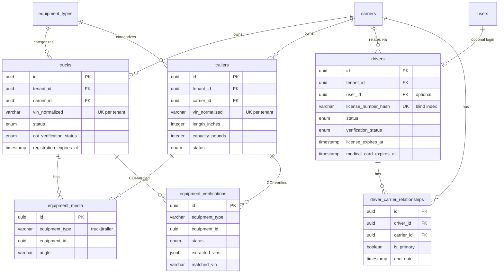

| Table | Purpose | Key columns | Invariants |
|---|---|---|---|
| `trucks` | A power unit. | `vinNormalized` (UK per tenant, uppercased/O-I-Q-normalized), `status` (pending_verification→active→out_of_service→archived), `coiVerificationStatus`, `registrationExpiresAt`/`nextInspectionDueAt` | UK also on `(tenantId, carrierId, unitNumber)`. |
| `trailers` | A trailer, with heavy-haul-specific dimensions. | `lengthInches`/`widthInches`/`deckHeightInches`/`wellLengthInches`/`capacityPounds` (all imperial), `removableGooseneck`, `isExtendable` | Same VIN/unit-number uniqueness pattern as `trucks`. |
| `equipment_media` | Photos/video for one truck or trailer, polymorphic by `(equipmentType, equipmentId)`. | `angle` (front\|rear\|driver_side\|passenger_side\|interior\|detail\|video) | Compliance gate requires ≥4 photos before activation (architecture.md §7). |
| `equipment_verifications` | COI-to-VIN matching outcome for one piece of equipment. | `extractedVins` (OCR output), `matchedVin`, `blockingReasons` (explicit array, e.g. `vin_not_on_coi`) | `ocrConfidence`, `overriddenByUserId`/`overrideReason` for the Admin/Accounting override path. |
| `drivers` | A person who may drive for one or more carriers in this tenant. | `licenseNumberEncrypted`/`licenseNumberLast4` (AES-256-GCM) + `licenseNumberHash` (HMAC blind index for uniqueness without decryption), `status`, `verificationStatus`, `licenseExpiresAt`, `medicalCardExpiresAt`, `trackingConsentGrantedAt`, `smsConsentGrantedAt` | UK on `(tenantId, licenseNumberHash)` — duplicate license detection without ever decrypting. `userId` is optional: a driver record can exist before the person has logged in. |
| `driver_carrier_relationships` | Which carrier(s) a driver runs for, with approval and history. | `isPrimary`, `approvedByUserId`/`approvedAt`, `startDate`/`endDate` | UK on `(tenantId, driverId, carrierId, startDate)` — re-engaging a driver after an end date is a new row, not an update. |

---

### 7.5 Customers

`customer.ts` — 4 tables.

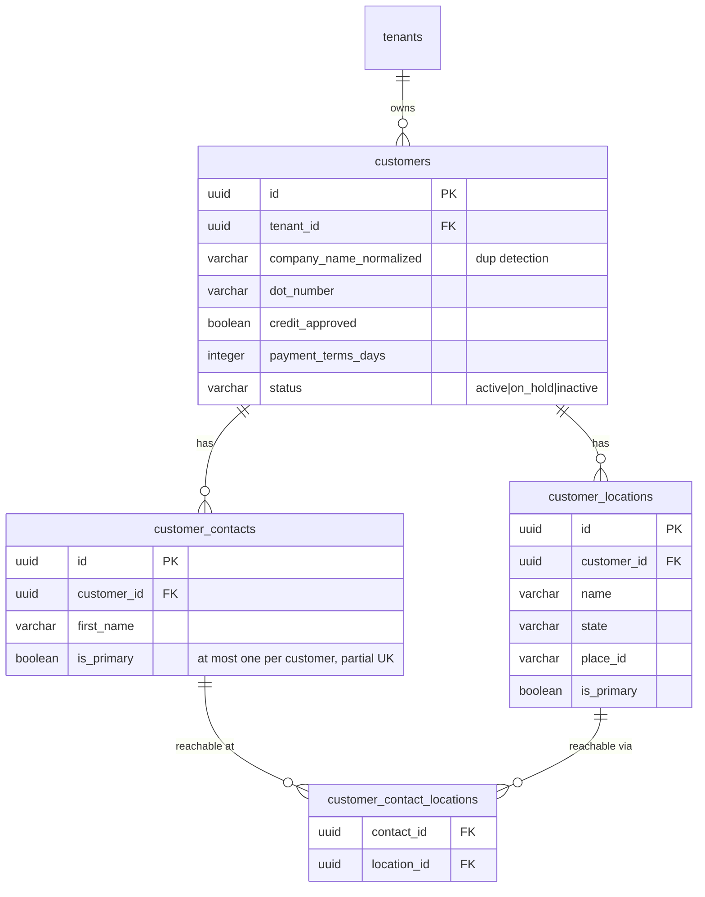

| Table | Purpose | Key columns | Invariants |
|---|---|---|---|
| `customers` | A shipper/broker the tenant does business with. **No user account this release** — see `docs/assumptions.md`. | `companyNameNormalized` (duplicate detection), `taxIdEncrypted`/`taxIdLast4`, `creditLimitCents`/`creditApproved`, `duplicateOverrideByUserId`/`duplicateOverrideReason` | `customers_tenant_dot_idx`/`_mc_idx`/`_phone_idx`/`_email_idx` all back the duplicate-detection typeahead. |
| `customer_locations` | A pickup/delivery site belonging to a customer, geocoded once and reused across loads. | `placeId` (Google Places reference), `timezone`, `isPrimary` | — |
| `customer_contacts` | A person at the customer. | `isPrimary` | Partial unique index enforces at most one primary contact per customer (`WHERE is_primary = true AND deleted_at IS NULL`), so this is a database invariant, not just service-layer discipline. |
| `customer_contact_locations` | Which contacts are reachable at which locations (many-to-many). | UK on `(contactId, locationId)` | — |

---

### 7.6 Loads & stops

`load.ts` — 7 tables.

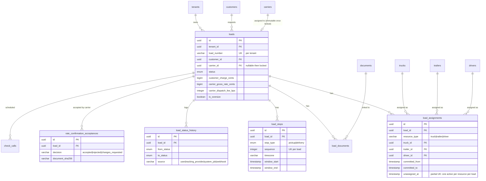

| Table | Purpose | Key columns | Invariants |
|---|---|---|---|
| `loads` | The central operational record — one shipment. | `loadNumber` (UK per tenant, `{prefix}-{sequence}` from `tenantSettings`), `carrierId`/`carrierLockedAt` (once set, immutable — see `tests/integration/loads/carrier-immutability.test.ts`), full status lifecycle (`draft`→…→`paid`/`cancelled`), dimension/weight columns, `carrierDispatchFeeBps`/`dispatcherCommissionBps`/`dispatcherCommissionBasis` (snapshotted onto the load at creation, then again into `financial_snapshots` at calculation time) | `loads_tenant_number_uq`; 9 further indexes for status/customer/carrier/dispatcher/date/oversize filtering (see §6). |
| `load_stops` | One pickup or delivery on a load, in sequence. | `sequence` (UK per load), `appointmentType` (exact\|window\|fcfs\|open), `timezone` (facility-local — display always resolves here first per architecture.md §10), `detentionMinutes`/`detentionNotes` | — |
| `load_assignments` | One resource (truck, trailer, or driver) committed to a load. | `resourceType`, exactly one of `truckId`/`trailerId`/`driverId` set, `committedFrom`/`committedTo`, `complianceSnapshot` (frozen at assignment time) | Three partial unique indexes (`WHERE <resource>_id IS NOT NULL AND unassigned_at IS NULL`) guarantee at most one *active* assignment per resource type per load — reassigning is a new row plus `unassignedAt` on the old one, not an update. |
| `load_status_history` | Append-only status-change ledger. | `source` (user\|tracking_provider\|system_job\|webhook), `sourceReference` | DB-enforced append-only (§3). |
| `load_documents` | Which documents are attached to which load (and optionally which stop). | UK on `(loadId, documentId)` | — |
| `rate_confirmation_acceptances` | The carrier's accept/reject/changes-requested decision on a rate confirmation PDF, with the exact PDF hash they saw. | `documentSha256`, `ratedAmountCents` | Retention-class `operational`, but functions as evidence — see `docs/assumptions.md`. |
| `check_calls` | Scheduled or ad-hoc status check-ins on a load. | `origin` (scheduled\|provider_event\|manual), `scheduledFor`/`completedAt` | `check_calls_due_idx` on `(tenantId, completedAt, scheduledFor)` backs the "overdue check calls" view. |

---

### 7.7 Routes, oversize & permits

`route.ts` — 6 tables.

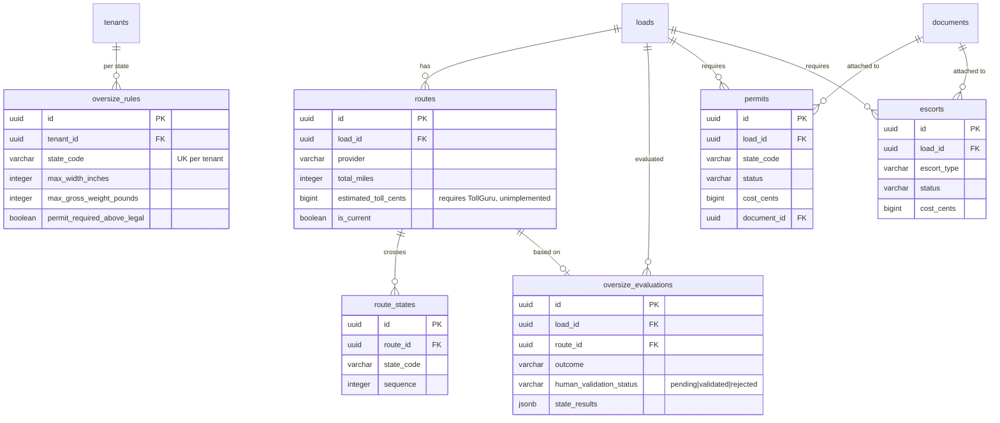

| Table | Purpose | Key columns | Invariants |
|---|---|---|---|
| `routes` | A calculated route for a load (may be recalculated; `isCurrent` marks the latest). | `legs` (jsonb array with per-leg miles/duration/states), `estimatedTollCents` (populated only if a live toll provider exists — TollGuru does not this release, see `docs/integrations.md`), `polyline` | `routes_load_idx` on `(loadId, calculatedAt)`. |
| `route_states` | Ordered list of states a route crosses. | UK on `(routeId, stateCode, sequence)` | Feeds oversize evaluation state-by-state. |
| `oversize_rules` | Per-state legal dimension/weight limits and escort thresholds — **operator-maintained guidance, not a legal determination**; see `docs/assumptions.md`. | `maxWidthInches`/`maxHeightInches`/`maxLengthInches`/`maxGrossWeightPounds`/`maxAxleWeightPounds`, escort thresholds, `travelRestrictions` (jsonb: night/weekend/holiday prohibitions, curfew windows) | UK on `(tenantId, stateCode)` — seeded once per tenant, then tenant-editable. |
| `oversize_evaluations` | One evaluation run against a load's current dimensions and route. | `outcome`, `stateResults` (jsonb, per-state exceedances), `inputs` (snapshotted so a later dimension edit doesn't rewrite history), `humanValidationStatus` (pending→validated/rejected — the compliance gate architecture.md §7 requires before dispatch) | — |
| `permits` | One state permit for an oversize/overweight load. | `status` (pending\|requested\|issued\|expired\|rejected\|not_required), `costCents`, `documentId`, `routeSurveyDocumentId` | UK on `(loadId, stateCode, permitNumber)`; `permits_expiry_idx` backs the expiration sweep. |
| `escorts` | One escort (pilot car, police, height pole, route survey) for a load. | `escortType`, `status`, `costCents` | — |

---

### 7.8 Financials

`finance.ts` — 11 tables.

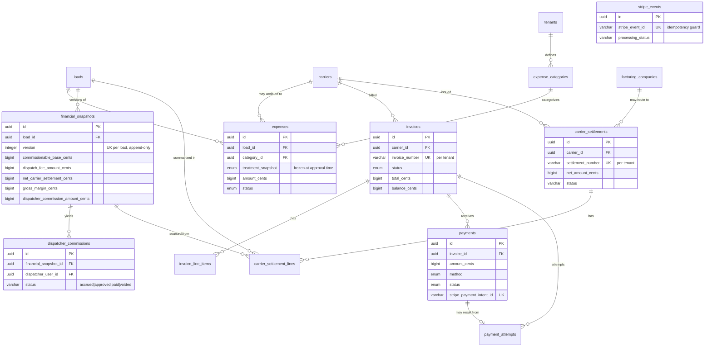

| Table | Purpose | Key columns | Invariants |
|---|---|---|---|
| `expense_categories` | Tenant-configurable expense taxonomy and its money treatment (see §4). | `treatment` (excluded_from_commission\|reimbursable_to_carrier\|tenant_absorbed\|carrier_deduction), `isSystem` (permits/escorts ship pre-seeded as `excluded_from_commission`) | UK on `(tenantId, code)`. |
| `expenses` | One expense against a load or a carrier generally. | `treatmentSnapshot` (frozen from the category at submission — a later category edit cannot rewrite settled math), `status` (submitted→approved/rejected→reimbursed) | Only `approved`/`reimbursed` rows are included in any financial calculation (§4). |
| `financial_snapshots` | Immutable, versioned calculation history for one load. | See §4. | Append-only per §3; UK on `(loadId, version)`. |
| `dispatcher_commissions` | One dispatcher's earned commission from one snapshot. | `basis`/`basisAmountCents`/`percentageBps`/`amountCents`, `status` (accrued→approved→paid, or voided) | UK on `(financialSnapshotId, dispatcherUserId)` — one commission row per dispatcher per snapshot version. |
| `invoices` | **Goliath Dispatch invoices the carrier** for the dispatch fee (not the customer, by default — see `customerId` being optional for tenants that also bill customers directly). | `invoiceNumber` (UK per tenant), `status` (draft→sent→due→paid/overdue/disputed/voided/uncollectable), `stripeInvoiceId`/`stripePaymentIntentId` | — |
| `invoice_line_items` | One line on an invoice. | `kind` (dispatch_fee\|expense\|adjustment\|credit) | — |
| `payments` | One payment against an invoice. | `method`, `status`, `stripePaymentIntentId` (UK — one payment row per Stripe intent), `refundedAmountCents` | — |
| `payment_attempts` | Every attempt (including failures) to collect a payment, distinct from the successful `payments` row. | `idempotencyKey` (UK), `failureCode`/`failureMessage` | — |
| `stripe_events` | The webhook idempotency ledger — see `docs/integrations.md`'s Stripe section. | `stripeEventId` (UK), `processingStatus` (received→processed/ignored/failed) | Narrowly mutable per §3; deletes always rejected. |
| `carrier_settlements` | One settlement statement issued to a carrier for a period. | `settlementNumber` (UK per tenant), `netAmountCents`, `factoringCompanyId`/`factoringSubmittedAt` (manual factoring — no funding call happens here) | — |
| `carrier_settlement_lines` | One load's contribution to a settlement, sourced from a specific `financialSnapshotId`. | — | — |

---

### 7.9 Messaging & notifications

`messaging.ts` — 7 tables.

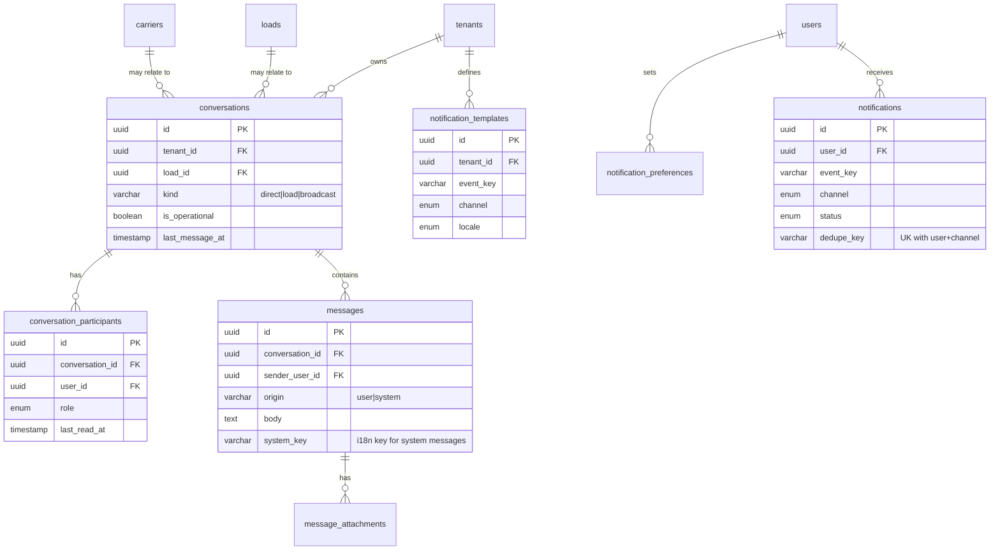

| Table | Purpose | Key columns | Invariants |
|---|---|---|---|
| `conversations` | A thread — direct, load-scoped, or a broadcast. | `kind`, `isOperational` (flags a thread for stricter retention), `lastMessageAt` (denormalized for sort) | — |
| `conversation_participants` | Membership in a conversation, with read/mute/leave state. | UK on `(conversationId, userId)` | — |
| `messages` | One message. System-narrated status changes use `origin = 'system'` with `systemKey`/`systemParams` instead of hard-coded text, so they render bilingually like everything else. | `body`, `systemKey` | The application UI is **polled, not pushed** — see `docs/assumptions.md`. |
| `message_attachments` | A file attached to a message. | `sha256` | — |
| `notification_templates` | Per-tenant, per-channel, per-locale copy for an event key. New event types are added to the catalog, never to the delivery pipeline. | UK on `(tenantId, eventKey, channel, locale)` | — |
| `notification_preferences` | A user's per-event channel opt-in/out. | UK on `(tenantId, userId, eventKey)` | — |
| `notifications` | One queued/sent notification (in-app, email, or SMS). | `dedupeKey` (UK with `userId`+`channel` — repeat sweeps are idempotent), `status` (queued→sent/delivered/failed/read, or suppressed) | `notifications_user_unread_idx` on `(tenantId, userId, readAt)`. |

---

### 7.10 Tracking

`tracking.ts` — 4 tables.

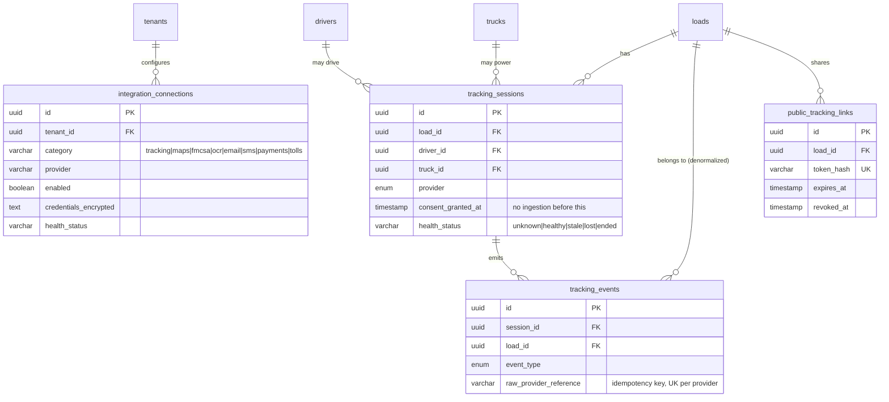

| Table | Purpose | Key columns | Invariants |
|---|---|---|---|
| `integration_connections` | One provider connection per tenant per category, with envelope-encrypted credentials and a health snapshot. | `credentialsEncrypted` (never returned to the client), `config` (non-secret, safe to render), `healthStatus` | UK on `(tenantId, category, provider)`. |
| `tracking_sessions` | One tracking session for one load. | `consentGrantedAt`/`consentRevokedAt` (**no location is ingested before consent is recorded** — architecture-level rule, not just UI copy), `healthStatus` (unknown\|healthy\|stale\|lost\|ended), `routeProgressPercent`/`etaAt` | UK on `(provider, providerSessionId)`. |
| `tracking_events` | One normalized location/status event. | `rawProviderReference` (the idempotency key for ingestion — UK per provider) | `tracking_events_session_idx` on `(sessionId, occurredAt)`. |
| `public_tracking_links` | A signed, expiring, no-account link a customer uses to view one load's narrow public projection. | `tokenHash` (UK — raw token never stored), `expiresAt`, `revokedAt`, `viewCount` | `public_tracking_links_expiry_idx` backs the hourly expiry sweep. |

---

### 7.11 Platform, audit & retention

`platform.ts` — 8 tables.

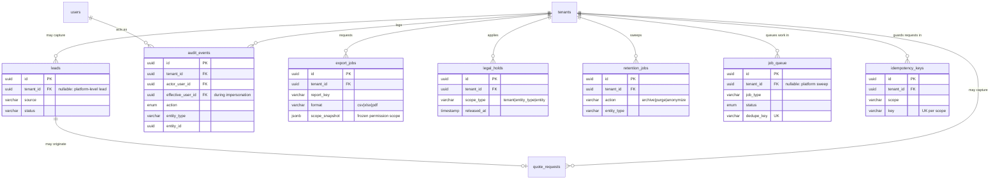

| Table | Purpose | Key columns | Invariants |
|---|---|---|---|
| `leads` | Marketing-site contact/carrier-signup/quote-resources capture. `tenantId` is nullable — a platform-level SaaS lead has none. | `source`, `utm`, `status` (new→contacted→qualified→converted/disqualified) | — |
| `quote_requests` | A structured freight-quote request from the marketing site, optionally linked to a `lead`. | Dimension/weight/route columns mirror `loads` | — |
| `audit_events` | The append-only audit trail for the entire product. | `actorUserId` (who authenticated) vs `effectiveUserId` (whose authority the action ran under — differs during impersonation), `action` (closed enum, ~50 values), `beforeSummary`/`afterSummary` (redacted diffs — sensitive values never stored here), `reason` (required for overrides/impersonation/deletions/holds) | DB-enforced append-only (§3); `tenantId` uses `onDelete: 'restrict'`, the only FK in the schema that blocks tenant deletion rather than cascading, precisely so an audit trail can never be deleted alongside its tenant. |
| `export_jobs` | One requested report export. | `scopeSnapshot` (the requester's permission scope frozen at generation time — an export never widens beyond what its requester could see when they asked) | — |
| `legal_holds` | One hold, tenant-wide, entity-type-wide, or on a specific record. | `scopeType`, `appliedByUserId`/`appliedAt`, `releasedByUserId`/`releasedAt`/`releaseReason` | See `docs/operations.md` for the operational procedure. |
| `retention_jobs` | One run of the archive/purge/anonymize sweep, with counts. | `candidateCount`/`processedCount`/`skippedLegalHoldCount` | — |
| `job_queue` | The durable background-job queue (architecture.md §8). | `dedupeKey` (UK), `lockedBy`/`lockedUntil` (lease), `attempts`/`maxAttempts` | See `docs/operations.md` for the full job catalog. |
| `idempotency_keys` | Generic idempotency ledger for inbound webhooks and mutating API routes beyond the job queue's own dedup. | UK on `(scope, key)` | — |
